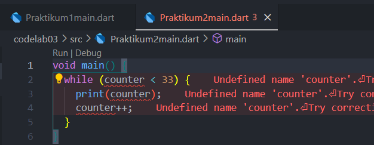

PRAKTIKUM 1

Soal 1

Ketik atau salin kode program berikut ke dalam fungsi main().

Soal 2

Silakan coba eksekusi (Run) kode pada langkah 1 tersebut. Apa yang terjadi? Jelaskan!

-Penulisan kata kunci harus huruf kecil: gunakan if, else if, dan else (bukan If atau Else).

-Struktur else if harus ditulis dalam satu baris, bukan dipisah.

-Setiap blok if/else sebaiknya menggunakan tanda kurung kurawal {}.

-Pastikan tanda kurung buka dan tutup pada kondisi if lengkap.

-Fungsi print digunakan langsung tanpa deklarasi ulang.

Soal 3

masih error, lalu setelah revisi seperti ini

PRAKTIKUM 2

Soal 1

Soal 2

revisi

Error terjadi karena variabel counter belum dideklarasikan sebelum digunakan di dalam while loop. Solusinya, deklarasikan dan inisialisasi counter terlebih dahulu, misal: int counter = 0;. Setelah itu, kode akan berjalan tanpa error.

Soal 3

Setelah menambahkan kode do-while, program mencetak angka dari 0 sampai 76 secara berurutan. Perulangan pertama (while) mencetak 0–32, lalu perulangan kedua (do-while) mencetak 33–76. Jadi, seluruh angka dari 0 hingga 76 akan ditampilkan.

PRAKTIKUM 3

Soal 1

Soal 2

-Variabel index belum dideklarasikan.

-Penulisan nama variabel tidak konsisten (Index vs index).

-Tidak ada increment (index++) pada for loop.

revisi

Soal 3

terjadi error

revisi

Kode melakukan perulangan dari 10 sampai sebelum 27.

    -Jika index 21, perulangan berhenti (break).

    -Jika index 11–16, angka dilewati (continue).

    -Hanya angka 10, 17, 18, 19, dan 20 yang dicetak.