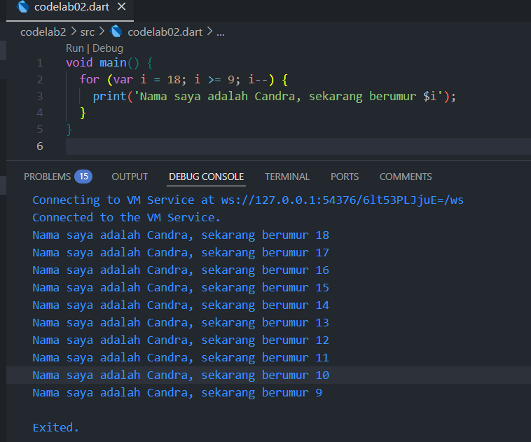
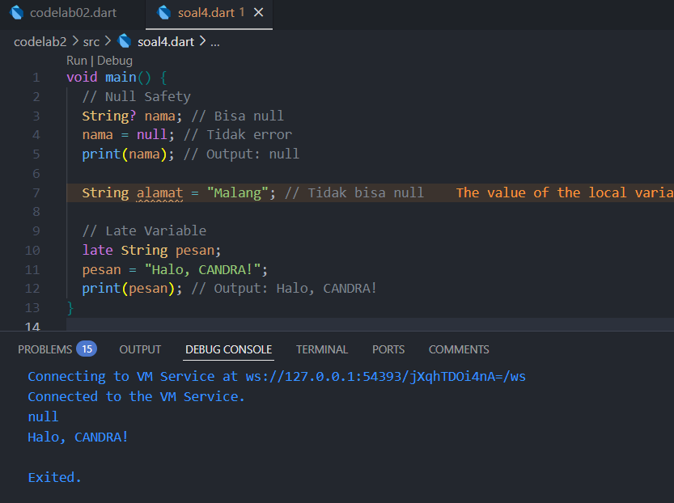

Soal 1

Modifikasilah kode pada baris 3 di VS Code atau Editor Code favorit Anda berikut ini agar mendapatkan keluaran (output) sesuai yang diminta!

Tampilan Screenshot

Soal 2

Mengapa sangat penting untuk memahami bahasa pemrograman Dart sebelum kita menggunakan framework Flutter ? Jelaskan!

Memahami Dart sangat penting sebelum menggunakan Flutter karena Flutter menggunakan Dart untuk menulis kode aplikasi. Dengan menguasai Dart, dapat lebih mudah membuat, memahami, dan memperbaiki aplikasi Flutter secara efisien.

Soal 3

Rangkumlah materi dari codelab ini menjadi poin-poin penting yang dapat Anda gunakan untuk membantu proses pengembangan aplikasi mobile menggunakan framework Flutter.

• Dart adalah inti dari Flutter, dipilih karena modern, fleksibel, dan mendukung lintas platform.

• Memahami Dart penting untuk produktivitas dan kenyamanan dalam pengembangan Flutter.

• Dart menawarkan fitur modern seperti productive tooling, garbage collection, type annotations (opsional), type safety, dan portability.

• Dart berevolusi dari pengembangan web ke mobile, dengan performa tinggi dan alat pengembangan yang baik.

• Kode Dart dapat dieksekusi melalui Dart VM (JIT/AOT) atau dikompilasi ke JavaScript.

• Dart mendukung OOP (encapsulation, inheritance, polymorphism, dll) dan sintaks mirip bahasa C/JavaScript.

• Operator Dart meliputi aritmatika, increment/decrement, equality, relational, dan logical, dengan perilaku yang konsisten dan aman tipe.

• Pemahaman dasar Dart memudahkan pengembangan aplikasi Flutter dan eksplorasi fitur-fiturnya.

Soal 4

Buatlah penjelasan dan contoh eksekusi kode tentang perbedaan Null Safety dan Late variabel !

Tampilan Screenshot

Null Safety Null safety adalah fitur Dart yang mencegah terjadinya error akibat nilai null pada variabel yang tidak diizinkan null. Dengan null Safety, variabel harus dideklarasikan apakah bisa bernilai null (String?) atau tidak (String). Hal ini dapat membantu menghindari bug runtime.

Late Variable Kata kunci late digunakan untuk menunda inisialisasi variabel non-nullable sampai nanti, tetapi tetap menjamin variabel akan diinisialisasi sebelum digunakan. Cocok untuk variabel yang nilainya baru diketahui setelah deklarasi, tapi tidak boleh null. Contoh kode